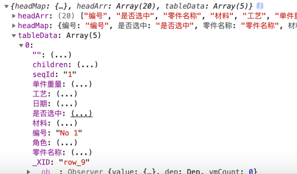

# cvx
convert tree xlsx import into vxe-grid metadata


# Install
```text
yarn add cvx
```

# How to use
```javascript

import { cvx } from 'cvx';

<vxe-button>
   <input type="file" @change="importDataEvent" accept=".xls,.xlsx,.csv">
</vxe-button>

const mockVueMehtods = {
  importDataEvent (evnt) {
      cvx(evnt, this, {
        tree: true
      })
        .then(res => {
          console.log(res)
          const {
            tableData
          } = res
          this.tableData = tableData
        })
        .catch(e => {
          console.error(e)
        })
  }
}
```

# Reference
## cvx inbound parameters
```markdown
/**
 * @param {object} evnt dom原生事件
 * @param {object} vm 组件实例
 * @param {object} opt 选项
 * @param {string} opt.FS 使用什么分割符号切割每一行字段，默认使用\\$，防止内容内出现逗号
 * @param {number} opt.tmout 解析超时
 * @param {boolean} opt.tree 是否树形目录
 */
```

## cvx promise return
```markdown
res.headArr {array<string|any>} 列表头（数组形式）
res.headMap {object<string,string|any>} 列表头（字典形式）
res.tableData {array<object|any>} 格式化后的数组

注意：当导入的是数组元素，会去tableData中第一列元素作为编号，同时每个元素都会有个seqId字段用来新编号,但同时保留了原编号供使用
```

 
