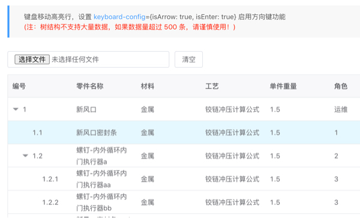

[](https://www.npmjs.com/package/zacard-cvx)
[](http://npm-stat.com/charts.html?package=zacard-cvx)
[](LICENSE)

# cvx
convert tree xlsx import into vxe-grid metadata


# Install
```text
yarn add zacard-cvx
```

# How to use
```markdown
参考examples/AppImp.vue
```
```javascript
import { cvx } from 'cvx';

<vxe-button>
   <input type="file" @change="importDataEvent" accept=".xls,.xlsx,.csv">
</vxe-button>

<vxe-grid
      ref="xTable"
      highlight-current-row
      :mouse-config="{selected: true}"
      :keyboard-config="{isArrow: true, isDel: true, isEnter: true, isTab: true, isEdit: true}"
      :edit-config="{trigger: 'dblclick', mode: 'cell'}"
      :checkbox-config="{range: true}"
      :columns="tableColumnDef"
      :data="tableData"
      :tree-config="{children: 'children'}"
    >
</vxe-grid>

// data定义
tableColumnDef: [
        { field: 'seqId', title: '编号', treeNode: true },
        { field: '零件名称', title: '零件名称' },
        { field: '材料', title: '材料' },
        { field: '工艺', title: '工艺' },
        { field: '单件重量', title: '单件重量' },
        { field: '角色', title: '角色' },
        { field: '日期', title: '日期' }
]

const mockVueMehtods = {
  importDataEvent (evnt) {
      cvx(evnt, this, {
        tree: true
      })
        .then(res => {
          console.log(res)
          const {
            tableData
          } = res
          this.tableData = tableData
        })
        .catch(e => {
          console.error(e)
        })
  }
}
```

# Reference
## cvx inbound parameters
```markdown
/**
 * @param {object} evnt dom原生事件
 * @param {object} vm 组件实例
 * @param {object} opt 选项
 * @param {string} opt.FS 使用什么分割符号切割每一行字段，默认使用\\$，防止内容内出现逗号
 * @param {number} opt.tmout 解析超时
 * @param {boolean} opt.tree 是否树形目录
 */
```
```markdown
也可以参考 vxe_hello 项目
```

## cvx promise return
```markdown
res.headArr {array<string|any>} 列表头（数组形式）
res.headMap {object<string,string|any>} 列表头（字典形式）
res.tableData {array<object|any>} 格式化后的数组

注意：当导入的是数组元素，会去tableData中第一列元素作为编号，同时每个元素都会有个seqId字段用来新编号,但同时保留了原编号供使用

// vxe-grid 树的column定义，注意使用treeNode: true
{ field: 'seqId', title: '编号', treeNode: true },
{ field: '零件名称', title: '零件名称' },
{ field: '材料', title: '材料' },
{ field: '工艺', title: '工艺' },
{ field: '单件重量', title: '单件重量' },
{ field: '角色', title: '角色' },
{ field: '日期', title: '日期' }
```

 
 
